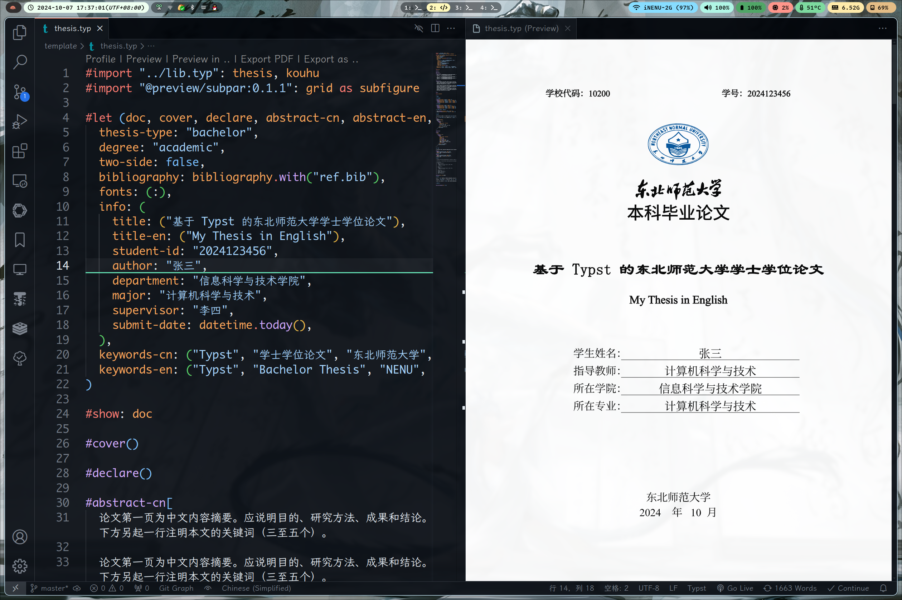

# NENU-Thesis-Typst-Template

东北师范大学毕业论文的 `Typst` 模板，可以在 [`template/thesis.typ`](./template/thesis.typ) 查看使用方法与生成的效果

> [!IMPORTANT]
>
> 此模板是民间模板，有不被学校认可的风险。
>
> 本模板虽已尽力尝试复原 LaTex 模板，但可能仍然存在诸多格式问题，详细请看[存在的问题](#存在的问题)

> [!CAUTION]
> 
> 模板暂不支持子图 `subfigure`

## 使用方法

> [!NOTE]
> 
> 模板暂时只支持本地编译使用

### 本地使用

1. 安装一个文本编辑器，这里推荐使用 `VS Code`，并安装 [Tinymist Typst](https://github.com/Myriad-Dreamin/tinymist) 和 [Typst Preview](https://github.com/Enter-tainer/typst-preview) 插件

- 克隆/下载本仓库到本地，并使用 `VS Code` 打开项目文件夹

- 打开 `template/thesis.typ` 文件，开始编写你的论文内容，可以按下 `<C-K> V` (Ctrl+K V) 快捷键在 `VS Code` 中打开预览窗口，实时查看你的论文效果

## TODO

- [x] 学士学位论文模板
    - [x] 封面
    - [x] 扉页
    - [x] 中文摘要
    - [x] 英文摘要
    - [x] 目录页
    - [x] 正文
    - [x] 致谢

- [ ] 硕士学位论文模板

- [ ] 博士学位论文模板

- [ ] 完善使用文档

## 存在的问题

1. 使用 `subpar` 时，无法正确显示子图的编号，如下图所示：

因此暂时不支持使用子图

2. 本科生论文不支持附录功能

3. 扉页中作者签名无法直接插入图片/PDF

## 致谢

- 感谢 [modern-nju-thesis](https://github.com/nju-lug/modern-nju-thesis) 开发的 `Typst` 模板，架构清晰，文档注释详细，本项目在架构上参考良多。
- 感谢 [SEU-Typst-Template](https://github.com/csimide/SEU-Typst-Template/) 开发的 `Typst` 模板
